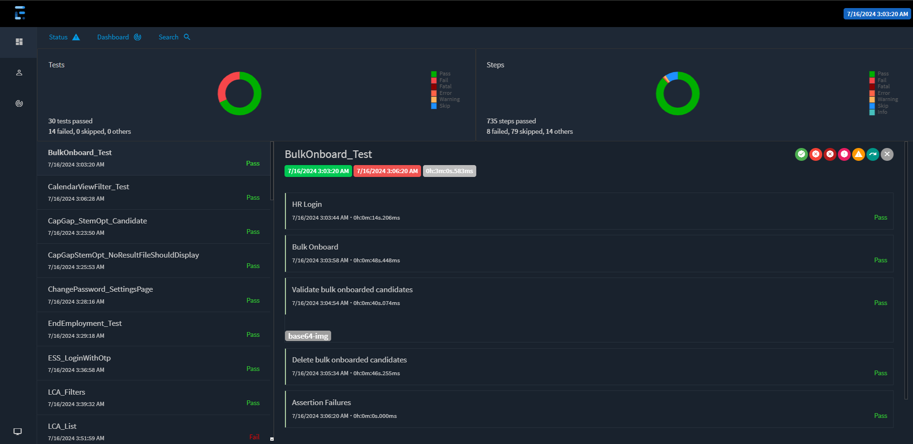

# Generating Reports for Tests

We use the [`ExtentReports`](https://extentreports.com){:target=_blank} library to generate reports for our tests in the `Reports` directory. The reports are generated in HTML format and can be viewed in any browser.

The `ExtentReports` library provides a simple API to create and manage reports. It also provides a way to log test steps and attach screenshots to the reports.

## **Adding ExtentReports to the Project**

---

To add the `ExtentReports` NuGet package to the project, run the following command in the terminal:

```bash
dotnet add package ExtentReports
```

_Note: This part is already done and you don't have to do it again._

## **Creating a Report**

---

To create a report, we need to create an instance of the `ExtentReports` class. We also need to create an instance of the `ExtentTest` class for each test case.

Here is an example of how to create a report:

=== "Example"

```csharp
using AventStack.ExtentReports;
using AventStack.ExtentReports.Reporter;

namespace ExtentReportsDemo
{
	class Program
	{
		static void Main(string[] args)
		{
			// Create an instance of ExtentReports
			var extent = new ExtentReports();

			// Create an instance of ExtentHtmlReporter and attach it to the ExtentReports
			var htmlReporter = new ExtentHtmlReporter("Reports\\TestReport.html");
			extent.AttachReporter(htmlReporter);

			// Create a test
			var test = extent.CreateTest("TestName");

			// Log test steps
			test.Log(Status.Pass, "Step 1");
			test.Log(Status.Pass, "Step 2");

			// End the test
			extent.Flush();
		}
	}
}
```

_Note: This is just an example of how to use the `ExtentReports` library, all of this is already configured in [`ReportsGenerationClass`](./reports-generation-class.md) and [`TestExecutionHelper`](./testexecution-helper.md)_

## **Using pre-built classes to Generate Reports**

---

We have created a class called `ReportsGenerationClass` that generates reports for the tests. This class uses the `ExtentReports` library to create and manage reports.

The `ReportsGenerationClass` class is inherited by the `TestExecutionHelper` which is in-turn inherited by all the tests.

### Using `ExecuteStep` method

---

The `ExecuteStep` method is used to log test steps in the report. (Use the [`ExecuteStep`](./testexecution-helper.md/#executestep) method which uses dictionary as the other overload method shall be removed in a future version.)

Let's consider our current step in the test is to login using the `Login` method. We can log this step in the report using the `ExecuteStep` method as shown below:

=== "ExecuteStep"
	```csharp
	ExecuteStep(() => Login(username, password), "Login", steps);
	```
=== "Dictionary"
	```csharp
	Dictionary<string, NodeDetails> steps = new Dictionary<string, NodeDetails>()
	{
		{ "Login", new NodeDetails( nodeName: "Login", stepDetails: "Login to the application" } }
	};
	```

Now, what the above method invocation would do is log the step "Login" in the report with the description "Login to the application" when the entire `Login()` method has finished executing. So, it'll essentially only log two steps one at the beginning of the method invocation and one at the end of its execution. To log any steps in between, we're going to pass the current `nodeName` inside our test step method and use the [`LogSubstep`](./reports-generation-class.md/#logsubstep) method to log the substeps.

### Using `LogSubstep` method

---

The `LogSubstep` method is used to log substeps in the report. This method is used to log the steps that are part of a test step.

Using the above example, let's consider that the `Login` method has the following steps:

1. Enter username
1. Enter password
1. Click on the login button
1. Verify the login

We can log these steps in the report using the `LogSubstep` method and also modify the `Test Method` as shown below:

=== "Login Method"
	```csharp
	public void Login(string username, string password, string nodeName)
	{
		driver.FindElement(By.Id("username")).SendKeys(username);
		LogSubstep(nodeName: "Enter username", stepDetails: $"Entered username - {username}", parentNodeName:nodeName);
		driver.FindElement(By.Id("password")).SendKeys(password);
		LogSubstep(nodeName: "Enter password", stepDetails: $"Entered password - {password}", parentNodeName:nodeName);
		driver.FindElement(By.Id("login")).Click();
		LogSubstep(nodeName: "Click on the login button", stepDetails: "Clicked on the login button", parentNodeName:nodeName);
		Assert.IsTrue(driver.FindElement(By.Id("welcome")).Text.Contains("Welcome"));
		LogSubstep(nodeName: "Verify the login", stepDetails: "Verified the login", parentNodeName:nodeName);
	}
	```

=== "Test Method"

	```csharp
	ExecuteStep(() => Login("admin", "admin123", "Login"), "Login", steps);
	```

So, the above method invocation would log the steps "Enter username", "Enter password", "Click on the login button", and "Verify the login" in the report with the description provided when the respective step is executed.

## **Viewing the Report**

---

The reports are generated in the `Reports` directory. To view the report, open the `Reports\Report dd_MM_yyyy` folder and open the `ExtentReport - dd_MMM_yy - hh_mm.html` file in a browser.

The report contains the following information:

1. Test name
1. Test status
1. Test steps
1. Test execution date and time

## **Good Practices**

---

1. **Log all test steps**: Log all the test steps in the report using the `ExecuteStep` and `LogSubstep` methods.
1. **Use meaningful step descriptions**: Use meaningful step descriptions to make the report more informative.
1. **Use the `ExecuteStep` method**: Use the `ExecuteStep` method to log the test steps in the report.
1. **Use the `LogSubstep` method**: Use the `LogSubstep` method to log the substeps in the report.
1. **Use the `NodeDetails` class**: Use the `NodeDetails` class to store the step details.
1. **Use the `Dictionary` class**: Use the `Dictionary` class to store the test steps.
1. **Use typed variables**: Use typed variables for step keys to ensure compile-time safety.

## **Report Example**

---

Here is an example of a report generated by the `ExtentReports` library:



- The top-left section shows the status of all tests in the current report.
- The top-right section shows the status of the test steps in all tests combined.
- The bottom section shows the details of each test, including the test name, status, and test steps.
- The test steps are color-coded based on their status (<span style="color:#00C853">Pass</span>, <span style="color:#F7464A">Fail</span>, <span style="color:#8B0000">Fatal</span>, <span style="color:#1E90FF">Skip</span>, <span style="color:#FDB45C">Warning</span> etc.,).
- The test steps can be expanded to view the details of each step.